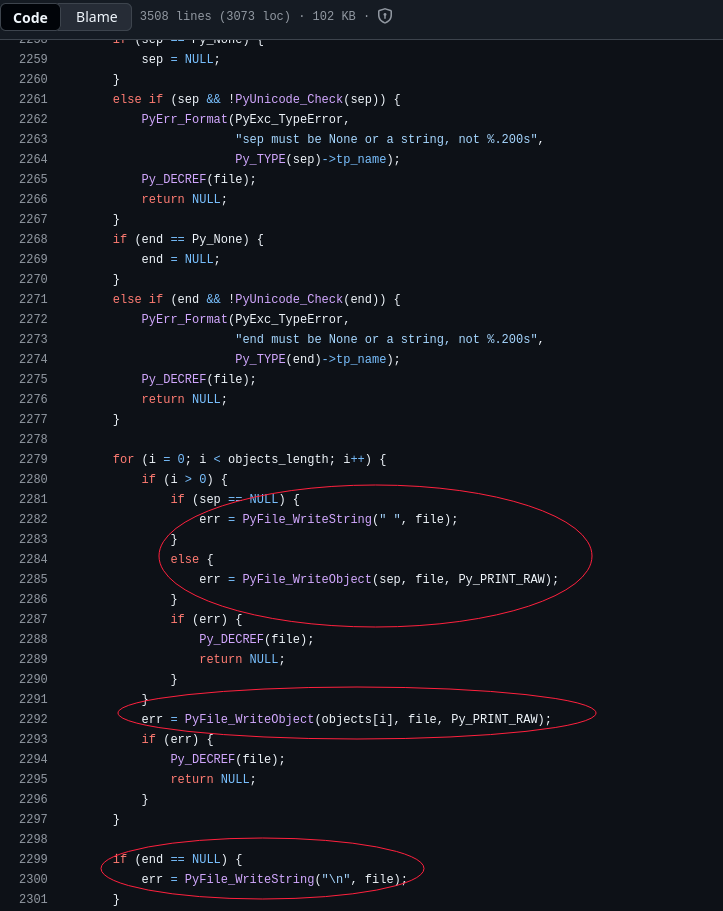
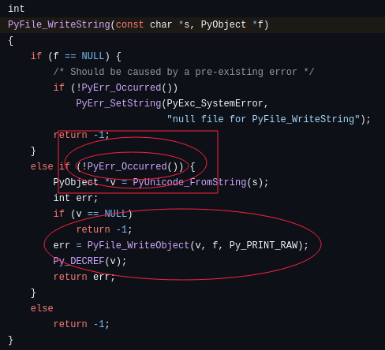
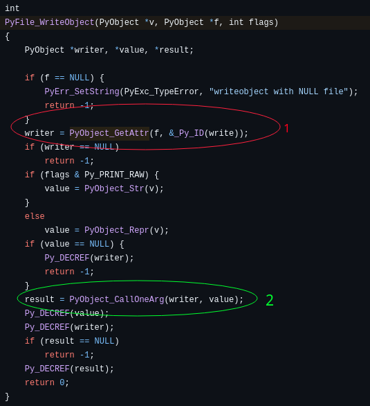
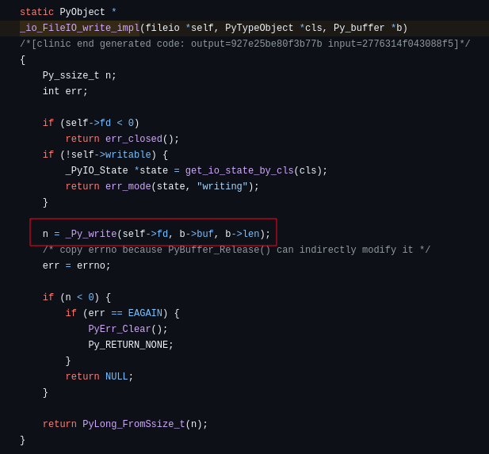
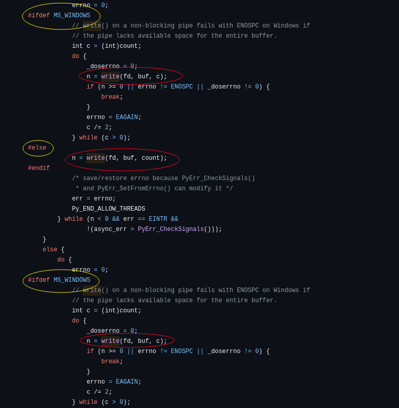

# Série: Des circuits au python: voyage à travers les abstractions en Informatique

# Introduction
Beaucoup de développeurs se passionnent aujourd’hui pour le Big Data, le full-stack ou l’IA… mais peu prennent le temps de découvrir la magie qui se cache sous leurs outils quotidiens.

J'ai passé une partie de l'année dernière à explorer les différents niveaux d'abstractions, et j'ai remarqué que c'était un "must"
pour les programmeurs de connaître ce qui se cache sous leurs écrans.

Peut-être que ce n'est pas que moi, mais vous aussi vous avez probablement entendu des phrases comme:
- Les langages de haut-niveau comme le Python sont plus lents
- Les langages de bas-niveau comme le C (ou C++) sont plus rapides et plus performants
- Un vrai programmeur est celui qui utilise l'assembleur(je fus du même accord jadis)
- et d'autres...
Dans cette série, nous allons explorer et mettre à l’épreuve ces idées, du plus bas niveau (assembleur) jusqu’au Python.

Partons d'un exemple concret:

```python
print("Bonjour le monde!")
```

> Supposons qu'on utilise l'implémentation par défaut de python(Cpython) car les autres implémentations fonctionnent d'une manière différente.
> Supposons aussi que nous sommes sur un système Linux et décortiquons ce petit programme qu'on vient d'écrire.

Normalement, ce programme affiche notre message "Bonjour le monde!" sur l'écran.

Il faut d’abord comprendre que certaines tâches, comme afficher des caractères à l’écran, sont plus complexes qu’on ne le croit.
C'est très complexe et pourrait remplir des dizaines d'articles pour expliquer comment on part de la lumière, en passant par le pixel,
puis par notre système de fenêtrage (x11, wayland, ...), jusqu'à ce que ces caractères soient visibles à nos yeux sur notre écran.
Et ceci n'est même pas proche du résumé de ce qui se passe réellement!

La prochaine fois que vous utiliserez print, souvenez-vous que chaque caractère traverse un chemin complexe depuis votre code jusqu’à l’écran.
Quand on vous a appris à afficher "Bonjour le monde!" dans votre langage de programmation préféré, vous avez acquis un grand pouvoir que vous ne le pensez!

Heureusement, nous n’avons pas besoin de réinventer la roue pour afficher chaque fois du texte à l’écran. <br />
Même les concepteurs des langages de programmation n’ont pas le temps de s’occuper eux-mêmes de cette tâche fastidieuse.

Sous Linux, le noyau nous fournit des centaines d’appels système qui sont des fonctions primitives qui permettent aux programmes d’interagir directement avec le matériel et le système.

Et dans notre cas précisément, on a un appel système pour afficher du texte à l'écran... l'appel système `write`:

```C
ssize_t write(int fd, const void *buf, size_t count);
```

La signature de cette fonction est en C, mais on trouve une fonction similaire dans beaucoup de langages de programmation.
En python, on aurait une chose semblable à ceci:
```python
def write(fd: int, buf: str, count: int) -> int
```
> En considérant que le ssize_t est un entier (ce qui est vrai mais pas entièrement)


Comme vous pouvez l'observer, on a 3 arguments pour l'appel système `write`:

1) fd (File Descriptor): Chaque fichier ouvert possède un numéro spécial appelé `file descriptor`.<br />
En Python, lorsque vous avez un fichier `file` ouvert, vous pouvez utiliser la méthode `fileno()` pour récuperer le file descriptor de `file`.<br />

```
file = open("fichier")
fd = file.fileno()  # Récuperer le numéro spécial 'fd' du fichier ouvert
print(fd)           # Afficher le fd de "fichier"
```

Mais chaque programme a 3 fichiers automatiquement ouverts: Le clavier, l'écran et le flux d'erreurs.<br />
- Le clavier est le `standard input` avec `fd=0`. <br />
- L'écran est le `standard output` avec `fd=1`.<br />
- Le flux d'erreurs est le `standard error` avec `fd=2`, généralement redirigé vers l'écran mais vous verrez que ce n'est pas toujours le cas.<br />

> Eh ouais, tout est fichier! On reviendra sur ce détail dans les prochains articles!

Le file descriptor est toujours un entier positif (jamais de 1.84 dans fd)! Si vous avez un `-1` c'est qu'il y'a eu probablement une erreur lors de l'ouverture du fichier.

2) buf: Buffer(Mémoire tampon) <br />

Voici une définition d'une mémoire tampon:
```
La mémoire utilisée pour le stockage temporaire de données lors du transfert d'informations.
```
<br />

La mémoire tampon n'est pas une mémoire à part, mais c'est juste une zone de mémoire que le programme désigne comme "tampon" pour y stocker de telles choses(objets). <br />
En d'autres mots, le programme marque un petit territoire comme "mémoire tampon" dans la RAM et ce territoire dans la RAM est utilisé à des fins spéciales(notamment pour la saisie des caractères sur le clavier aussi). <br />

> Pour ceux qui parle du C (c'est un langage après tout), ne pas vider la mémoire tampon dans des programmes qui intéragissent avec l'utilisateur est un bug!
> Heureusement, les concepteurs des SE introduisent des mécanismes pour contrer cela... mais videz toujours vos buffers, c'est une bonne pratique!

3) count: C'est le nombre de caractères qu'on va afficher à l'écran.

Ce nombre est calculé dynamiquement dans des langages de haut-niveau pour que vous n'ayez pas toujours à compter combien de caractères se trouvent dans "Bonjour le monde!" comme on le fait dans le C typiquement (on a des fonctions en C pour faire ça mais en général on le fait manuellement).

> Un caractère est représenté sur 1 octet (1 octet contient 8 bits).


En Python, on a une fonction similaire à `write` dans le module `os`:

```python
import os
import sys

# On récupère le file descriptor de la sortie standard
# sys.stdout correspond à la sortie standard (l'écran)

fd = sys.stdout.fileno()

os.write(fd, "Bonjour le monde!\n".encode())  # Ceci signifie "Écris sur l'écran le message 'Bonjour le monde!' "


# Vous pouvez afficher les file descriptors de standard input(clavier) et standard error:
# print(sys.stdin.fileno())
# print(sys.stderr.fileno())
# L'abbréviation de standard input est 'stdin' et celle de standard error est 'stderr'
```


Lorsque vous lancez ce programme, vous verrez ceci:
```
Bonjour le monde!
18
```

Ce nombre qui s'affiche c'est le nombre de caractères (bytes) qu'on vient d'afficher.
Miraculeusement, on a la fonction `os.write` qui ressemble à notre `write` que Linux nous offre en C:
```python
write(fd, data, /)  # Signature de la fonction `write` de `os`
```

Ce qui manque seulement c'est le `count`, mais j'avais bien précisé que le nombre de caractères était
calculé dynamiquement dans les langages de haut-niveau. Si c'était en C, compter qu'on a `18`
caractères serait de votre responsabilité.

À noter que cette fonction fait appel à l'appel système `write`, c'est juste une abstraction comme
vous pouvez l'observer. Après tout, le `count` est dynamiquement calculé pour vous... ce qui montre
que derrière les rideaux se cache une autre fonction primitive qui est appelé avec tous les
arguments bien remplis pour vous (cette fonction primitive étant `write`)!

Et si vous ne me croyez pas, je vais vous montrer l'implémentation de la fonction `print` dans le code du langage Python.

> Examinez les sections que j'ai marqué sinon vous risquez de vous perdre car le code de Cpython est immense.

L'objectif de cette section, c'est de vous montrer qu'à l'intérieur du `print` se cache un appel système `write`.

Pour commencer, examinons le fichier `Python/bltinmodule.c` dans le répértoire de Cpython sur github ():



On remarque directement que `print` se base sur deux fonctions: `PyFile_WriteString` et `PyFile_WriteObject`.

Dans le fichier `Objects/fileobject.c`, on y trouve le code de `PyFile_WriteString`:


La vérité est devant nous󰱮 : `PyFile_WriteString` utilise `PyFile_WriteObject`. Donc analysons `PyFile_WriteObject` pour trouver ce que `print` nous cache.


> Un 'writer' est une fonction qui utilise 'write' mais indirectement

- L'étape 1: Récuperer un `writer` approprié selon le type de fichiers (on n'affiche pas que des `str` en python)
- L'étape 2: Appeler ce `writer` et selon la valeur de retour, déterminer si c'est une erreur ou pas.

Exemple:
```python
import sys
import os

def writer(objet):
    fd = sys.stdout.fileno()
    os.write(fd, str(objet).encode())

class Objet:
    def __str__(self):
        return "Je suis Objet\n"

obj = Objet()
writer(obj)

```

> Ce programme affiche: Je suis Objet

Ce petit programme crée un `writer` utilisant un `write`(de `os`), et c'est ce que fait Python avec le `writer`. <br />
La différence c'est que Python écrit un `writer` utilisant `_io_FileIO_write_impl`.

> Trop de détails ne sont pas mentionnés pour ne pas trop creuser. Utilisez leur docs pour les contributeurs sur Github
> pour compléter les détails minutieux qui manquent.

L'implémentationde `_io_FileIO_write_impl` est la suivante:


Comme elle utilise `_Py_write`, examinons comment elle est implémentée:


󰱫 Et voilà!!! Le fameux `write`, avec les mêmes arguments se manifeste!!! Et en plus, Python fait un petit check pour voir si on est sur du Windows ou pas car chaque système a sa propre façon de faire la même chose.

Et ainsi se termine la première partie de cette série. Vous pouvez remarquer qu'on a passé par beaucoup de choses pour arriver à un simple `write` qu'on aurait pu écrire directement dans le C et puis afficher un petit texte à l'écran. Mais Python ajoute ses propres fonctionnalités, et donc leur utilisation de `write` devient de plus en plus compliquée! Ces fonctions que `print(...)` utilise pour arriver au `write` diminuent la performance du langage comparé à un simple `printf(...)` écrit en C. D'où on dit parfois que les langages de haut niveau ne sont pas si performants que les langages de bas-niveau comme le C/C++.

À la prochaine
